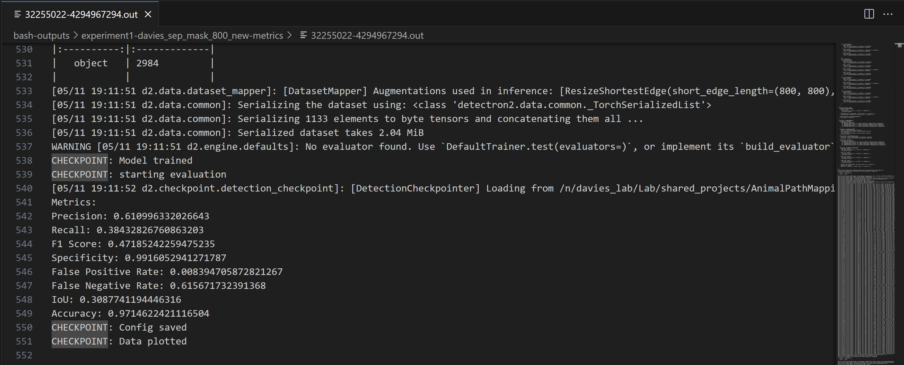

AnimalPathMapping: a Python package for autonomously labeling animal paths in RGB and LiDAR imagery taken by the Davies lab of conservation sites in Africa.

Getting started (note that every time you modify the code and want to run it, you'll have to do this):
To install the package, complete the following steps:
1. cd into the root directory of this package (the outer-level AnimalPathMapping folder)
2. activate the conda environment: "conda activate /n/davies_lab/Lab/shared_conda_envs/AnimalPathMapping"
    - if you do not have access to this environment, create your own conda environment with the packages listed in requirements.txt
3. run the command "python setup.py sdist"
    - this should create our distribution package and egg-info (you should see the folders 'dist/' and 'AnimalPathMapping.egg-info/' with our package in 'dist/')
    - after this step, our package can be installed with pip
4. run the command "pip install ./dist/AnimalPathMapping-0.0.1.tar.gz"
    - if this doesn't work, check the name of the .tar.gz file inside of the 'dist/' folder and replace 'AnimalPathMapping-0.0.1.tar.gz' with that file name, including the file extension.
    - if this was successful, you should be able to open a Python interpreter somewhere outside our project directory and use our package.  Examples of things to try:
        - cd one level out from where you are now.  Enter the command: "python3"
            - In the Python interpreter that opens, first run "from tests import hello_world"
            - If successful, run "hello_world.hello_world()"
                - you should get "Hello world!  This package is running!" printed to the console.
            - Try importing modules:
                - run: "import AnimalPathMapping"
                - run: "from AnimalPathMapping import models"
        - If all of these work, you are good to go!


________________________________________________________________________________

PROCESSING DATA:
________________________________________________________________________________

1. Rasterize the shapefiles containing the mask labels using the following steps (note that each distinct mask label should be assigned a unique id number when labeling in QGIS):
-   1. Open your RGB and thermal imagery .tiff files as well as your path label .shp file in QGIS.
-   2. In the QGIS processing toolbox, search for and select "Rasterize (vector to raster)".
-   3. Select your path label shapefile as your "Input layer".
-   4. In the "Field to use for burn-in value" select the field corresponding to the unique ids each path has been labeled with.
-   5. In the "A fixed value to burn", erase the default value so that this box is left empty.
-   6. In the "Output raster size units", select "Georeferenced units".
-   7. In the "Width/Horizontal resolution", type in the width/horizontal resolution of your RGB tiff file.  This can be found by TODO.
-   8. In the "Height/Vertical resolution", type in the height/vertical resolution of your RGB tiff file.  This can be found by TODO.
-   9. In the "Output extent", click the small down arrow to the far right of the box, past the icon with the mouse.  Hover over "Calculate from layer" in the menu that appears.  Select your RGB tiff file.
-   10. In "Assign a specified No-Data value to output bands", enter -999.
-   11. Under "Advanced Parameters", "Output data type", select 'Int16'
-   12. Under "Advanced Parameters",, "Pre-initialize the output image with value", enter 0.
-   13. Under Rasterized, click the three dots next to the box that says "[Save to temporary file]", click "Save to a file" in the menu that pops up, and type in a file name to save your rasterized path masks as, making sure it ends with ".tiff".
-   14. Click the "Run" button at the bottom of the window.  It may take several minutes to run, but you should get the rasterized path mask saved to the ".tiff" file you specified.  When it finishes, verify that it worked by zooming into a path label with this ".tiff" file visible and check for a gray line (note that the gray line may be so dark as to blend in with the black background, if this happens, keep searching through different path labels, particularly ones with high ID values).

2. Align the tiff images belonging to each data modality being used.  This includes the rasterized mask.  This produces orthomosaics for each image as .npy files.
-   1. Open 'AnimalPathMapping/sbatchs/data_processing/process_orthomosaics.sh' 
-   2. In this file, set values for the `thermal_tiff_path', `rgb_tiff_path', `lidar_tiff_path', `mask_tiff_path', `save_thermal', `save_lidar', and `save_mask' variables (read the specifications there, you will be directed to 'align_orthomosaics.py').

3. Tile each orthomosaic.  This slices them into squares of the same size so that they can be fed into the model.
-   1. Open 'AnimalPathMapping/sbatchs/data_processing/tile_orthomosaics.sh' 
-   2. In this file, set values for the `thermal_orthomosaic_path', `rgb_orthomosaic_path', `lidar_orthomosaic_path',  'path_mask_orthomosaic_path' `thermal_processing_constants_path', `save_thermal', 'save_rgb', `save_lidar', and `save_path_mask' variables (read the specifications there, you will also be directed to 'tile_orthomosaic.py').

4. (Optional, the default behavior if this is not done is to just use RGB imagery) If using both the RGB and thermal image modalities, combine them together with the following steps:  
-   1. Open 'AnimalPathMapping/sbatchs/data_processing/get_fuse_parallel_processing_cmds.sh' 

-   2. In this file, provide a value for the 'input_rgb_image_folder' variable.  See the comments above this variable for how to give it a value.  Ex: input_rgb_image_folder="/n/davies_lab/Lab/shared_projects/AnimalPathMapping/firestorm-3/image-tiles/all-tiles-400px/rgb-tiles/png-images", where all the image tiles belonging to the RGB and thermal modalities for the same original image are stored in the 'all-tiles-400px/' directory.  

    Then run this script by calling 'bash get_fuse_parallel_processing_cmds.sh' (note that your current working directory must be 'AnimalPathMapping/sbatchs/data_processing/')

-   3. When the previous command finishes, open 'AnimalPathMapping/sbatchs/data_processing/fuse_parallel_processing_cmds.sh' (this should be outputted by step 2).  Scroll to the bottom to see the last line number (that is, the line number of the last line of text).  Save this value, which we will now refer to as 'l'.

-   4. Open 'AnimalPathMapping/sbatchs/data_processing/fuse_parallel_processing.sh'.  Modify the line starting with '#SBATCH --array' to state '#SBATCH --array 1-l'.  For example, if in step 3., there were a total of 3 lines, this would be set to: 'SBATCH --array 1-3'.

    Then run this script by calling 'sbatch fuse_parallel_processing.sh' (note that your current working directory must be 'AnimalPathMapping/sbatchs/data_processing/')

-   5. Wait for the script to complete.  What should happen is that for each RGB image tile, a job is submitted to SLURM to fuse it with its corresponding thermal image tile.


5. Process the masks using the following steps:
-   1. Open 'AnimalPathMapping/sbatchs/data_processing/get_mask_parallel_processing_cmds.sh' 

-   2. In this file, provide a value for the 'input_mask_folder', 'output_mask_folder', and 'dilate_masks' variables.  See the comments above these variables for how to give them values.  Ex: input_mask_folder="/n/davies_lab/Lab/shared_projects/AnimalPathMapping/firestorm-3/image-tiles/all-tiles-400px/path-mask-tiles/numpy-images", where all the mask tiles corresponding to the RGB image tiles for the same original image are stored in the 'all-tiles-400px/' directory.  Make sure to read the comment above it for full specification of this path.  We very strongly suggest that you leave 'dilate_masks' as "True".

    Then run this script by calling 'bash get_mask_parallel_processing_cmds.sh' (note that your current working directory must be 'AnimalPathMapping/sbatchs/data_processing/')

-   3. When the previous command finishes, open 'AnimalPathMapping/sbatchs/data_processing/mask_parallel_processing_cmds.sh' (this should be outputted by step 2).  Scroll to the bottom to see the last line number (that is, the line number of the last line of text).  Save this value, which we will now refer to as 'l'.

-   4. Open 'AnimalPathMapping/sbatchs/data_processing/mask_parallel_processing.sh'.  Modify the line starting with '#SBATCH --array' to state '#SBATCH --array 1-l'.  For example, if in step 3., there were a total of 3 lines, this would be set to: 'SBATCH --array 1-3'.

    Then run this script by calling 'sbatch mask_parallel_processing.sh' (note that your current working directory must be 'AnimalPathMapping/sbatchs/data_processing/')

-   5. Wait for the script to complete.  What should happen is that for each mask tile, a job is submitted to SLURM to process it, creating a folder named by the image id it corresponds to that contains both segmentation masks (.npy files for training the model) and visualization masks.

6. (Optional, recommended when have a small number of images, which is <3000)
-   1. Open 'AnimalPathMapping/sbatchs/data_processing/get_rotation_parallel_processing_cmds.sh' 

-   2. In this file, provide a value for the 'input_image_folder', 'rotate_corresp_masks', and 'mask_folders'. See the comments above these variables for how to give them values.  

    Then run this script by calling 'bash get_rotation_parallel_processing_cmds.sh' (note that your current working directory must be 'AnimalPathMapping/sbatchs/data_processing/')

-   3. When the previous command finishes, open 'AnimalPathMapping/sbatchs/data_processing/rotation_parallel_processing_cmds.sh' (this should be outputted by step 2).  Scroll to the bottom to see the last line number (that is, the line number of the last line of text).  Save this value, which we will now refer to as 'l'.

-   4. Open 'AnimalPathMapping/sbatchs/data_processing/rotate_parallel_processing.sh'.  Modify the line starting with '#SBATCH --array' to state '#SBATCH --array 1-l'.  For example, if in step 3., there were a total of 3 lines, this would be set to: 'SBATCH --array 1-3'.

    Then run this script by calling 'sbatch rotate_parallel_processing.sh' (note that your current working directory must be 'AnimalPathMapping/sbatchs/data_processing/')

-   5. Wait for the script to complete.  What should happen is that for each RGB image tile, a job is submitted to SLURM to rotate it and its corresponding specified masks.

________________________________________________________________________________

RUNNING THE MODEL:
________________________________________________________________________________

1. cd `cs288-animal-paths/AnimalPathMapping/AnimalPathMapping/models/detectron2`

2. There are three files and accompanying bash scripts:
- `train_test_custom_data_new_metric_rotate.py`: training and testing code for rotated data (as seen in Experiment 3). Note that the training losses are plotted and stored in the output directory once the job completes. The testing data is printed as a part of the bash_output .out file near the end:



- `train_test_custom_data_new-metric.py`: training and testing code for all other data types. Note again that the training losses are plotted and stored in the output directory once the job completes. The testing data is printed as a part of the bash_output .out file near the end

- `train_val_custom_data_v2.py`: training and validation code

3. To customize each file, open their corresponding bash script (naming scheme `run_{FILENAME}`) and modify the img_dir, mask_dir, and output_dir variables to match the data and output location you want. For more information on image and mask directories, see the next section on Recreating Experiments.

4. Run the bash script to submit a job to the cluster using `sbatch <FILENAME>`. Periodically check the corresponding .err and .out files for any results or checkpoint updates (especially relevant considering the complicated data directory structure for this project).

________________________________________________________________________________

RECREATING EXPERIMENTS:
________________________________________________________________________________

**NOTE:** The png image names are sometimes different depending on the experiment. This requires you to adjust a small part of the code of `train_test_custom_data_new_metric.py` for it to run (line 71 in the originally submitted version):

```
image_files = [f for f in os.listdir(img_dir) if f.startswith('image') and f.endswith('.png') and f.split('-')[-1].split('.')[0] in ids]
```

Instead of f.startswith('image'), replace this with the corresponding data images' naming convention (for fused data it is 'image', thermal-tiles data is 'thermal', and everything else is 'rgb')

### To find the experiment results mentioned in our paper:

1. cd `cs288-animal-paths/AnimalPathMapping/data/model_outputs`

2. There are two folders:
- `experiment_outputs`: contains all five experiment outputs, including their labeled images, training results, and bash_output files with the test results

- `train_validate_outputs`: contains the training-validation losses and labeled images that were used for hyperparameter tuning (see Model Training section of the submitted paper)

### To find the raw image data for recreating the experiments:

1. cd `cs288-animal-paths/AnimalPathMapping/data/firestorm-3`

2. The following are a list of data sub-directories with their corresponding attributes - these can be directly copy-pasted into the bash scripts mentioned in the previous 'RUNNING THE MODEL' section to run:

**Original (Davies' Lab) Data:**

*RGB Images*
- `../../../data/firestorm-3/image-tiles/all-tiles-400px/rgb-tiles`: for 400x400px images
- `../../../data/firestorm-3/image-tiles/all-tiles-800px/rgb-tiles`: for 800x800px images
- `../../../data/firestorm-3/image-tiles/all-tiles-1200px/rgb-tiles`: for 1200x1200px images

*Thermal/Fusion Images*
- `../../../data/firestorm-3/image-tiles/all-tiles-800px/fused/<RATIO>`: for 800x800px thermal imagery, must choose a specific subdirectory for the ratio of thermal:RGB
- `../../../data/firestorm-3/image-tiles/all-tiles-800px/thermal-tiles`: for 800x800px thermal imagery, 100% thermal not fused

*Normal (Separated) Masks*
- `../../../data/firestorm-3/image-tiles/all-tiles-400px/path-masks-finished`: for 400x400px images, separated masks (individual mask per path)
- `../../../data/firestorm-3/image-tiles/all-tiles-800px/path-masks-finished`: for 800x800px images, separated masks (individual mask per path)
- `../../../data/firestorm-3/image-tiles/all-tiles-1200px/path-masks-finished`: for 1200x1200px images, separated masks (individual mask per path)

*Merged Masks*
- `../../../data/firestorm-3/image-tiles/all-tiles-800px/path-masks-finished/masks_tog_dilated`: for 800x800px images, merged masks (one mask per tile)

**Hand-labeled (by the project group) Data:**

*RGB Images*
- `../../../data/firestorm-3/image-tiles/clipped-relabeled-tiles/tiles-400px`: for 400x400px images
- `../../../data/firestorm-3/image-tiles/clipped-relabeled-tiles/tiles-800px`: for 800x800px images
- `../../../data/firestorm-3/image-tiles/clipped-relabeled-tiles/tiles-1200px`: for 1200x1200px images

*Rotated Images*
- `../../../data/firestorm-3/image-tiles/clipped-relabeled-tiles/tiles-800px/rotated/rgb-tiles`: for 800x800px images

*Rotated Masks*
- `../../../data/firestorm-3/image-tiles/clipped-relabeled-tiles/tiles-800px/rotated/path-masks-finished/masks_sep`: for 800x800px images, separated masks (individual mask per path)
- `../../../data/firestorm-3/image-tiles/clipped-relabeled-tiles/tiles-800px/rotated/path-masks-finished/masks_tog_fixed`: for 800x800px images, merged masks (one mask per tile)

*Normal (Separated) Masks*
- `../../../data/firestorm-3/image-tiles/clipped-relabeled-tiles/tiles-400px/path-masks-finished/masks_sep`: for 400x400px images, separated masks (individual mask per path)
- `../../../data/firestorm-3/image-tiles/clipped-relabeled-tiles/tiles-800px/path-masks-finished/masks_sep`: for 800x800px images, separated masks (individual mask per path)
- - `../../../data/firestorm-3/image-tiles/clipped-relabeled-tiles/tiles-1200px/path-masks-finished/masks_sep`: for 1200x1200px images, separated masks (individual mask per path)

*Merged Masks*
- `../../../data/firestorm-3/image-tiles/clipped-relabeled-tiles/tiles-800px/path-masks-finished/masks_tog_fixed`: for 800x800px images, merged masks (one mask per tile)


### List of experiments mentioned in the final paper

1. *Experiment 1:* Size of tile experiment [400px, 800px, 1200px]
2. *Experiment 2:* Hand labelled plus original label experiment [400px, 800px, 1200px]
3. *Experiment 3:* Rotation to hand labelled experiment [800px]
4. *Experiment 4:* Modality mix experiment [800px, hand labelled data]
5. *Experiment 5:* Split masks vs. unsplit masks experiment [800px, hand labelled and original data]